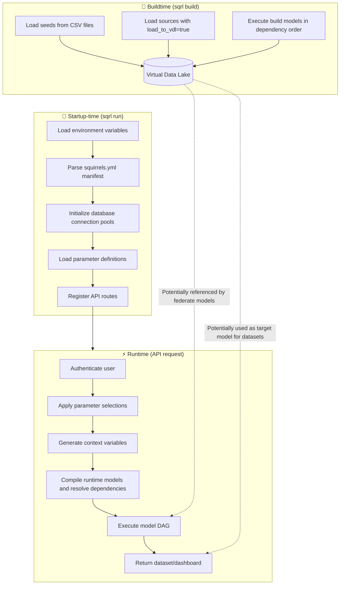
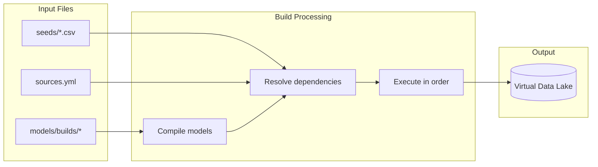
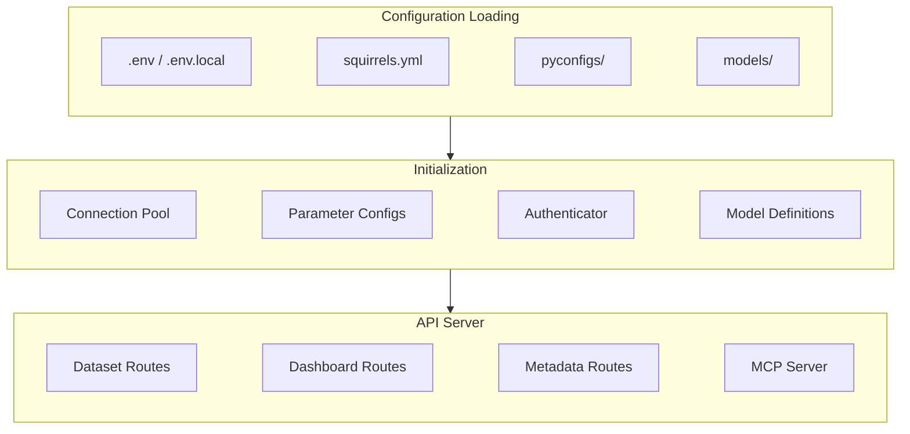
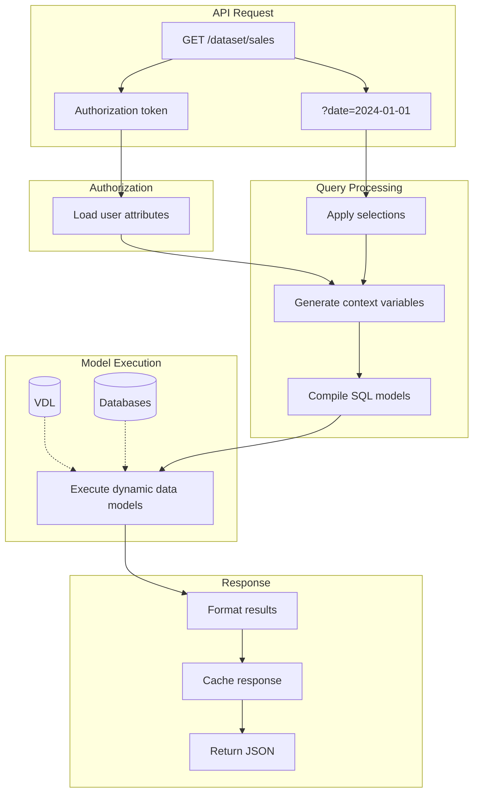

Squirrels projects operate in three distinct phases: **buildtime**, **server startup**, and **runtime**. Understanding these phases helps you design efficient data pipelines and optimize your analytics APIs.

## Overview

The following diagram illustrates the complete lifecycle of a Squirrels project:



## Buildtime

Buildtime occurs when you run [sqrl build]. During this phase, Squirrels prepares all static data that will be available for runtime queries.

<Tip>
  If there are no buildtime models (other than seeds) that are used by federate models or datasets, then this phase is optional!

  Seeds can still be referenced by federate models and datasets, even without loading them to the VDL.
</Tip>

### What happens during buildtime

1. **Load seeds**: CSV files from the `seeds/` directory are loaded into the [Virtual Data Lake (VDL)][VDL]
2. **Load sources**: External database tables configured with `load_to_vdl: true` are extracted and stored in the VDL
3. **Execute build models**: SQL and Python build models are compiled and executed in dependency order, with results materialized in the VDL

### Build process flow



## Server startup

Server startup occurs when you run [sqrl run]. This phase initializes all components needed to serve API requests.

### What happens during server startup

1. **Load [environment variables]**: Read from `.env` and `.env.local` files
2. **Parse manifest**: Load and validate `squirrels.yml` configuration
3. **Initialize connections**: Establish database connection pools
4. **Load parameter definitions**: Parse parameter configurations from `pyconfigs/parameters.py` or YAML
5. **Configure authentication**: Set up auth providers from `pyconfigs/user.py`
6. **Load model files**: Read all dbview and federate model definitions
7. **Register routes**: Create FastAPI endpoints for datasets and dashboards
8. **Start background tasks**: Initialize parameter refresh scheduler

### Server initialization flow



## Runtime

Runtime occurs when a client makes an API request for a dataset or dashboard. This is where dynamic data transformations happen.

### What happens during runtime

1. **Authenticate user**: Validate credentials and determine user permissions
2. **Apply selections**: Process user parameter selections against parameter definitions
3. **Generate context**: Create meaningful variables (i.e., context variables) from user attributes and parameter selections to use in runtime models
4. **Compile models**: Render Jinja SQL templates from context variables
5. **Build DAG**: Resolve model dependencies and create execution plan
6. **Execute models**: Run dbview and federate models in dependency order
7. **Return results**: Format and return the dataset or render the dashboard

### Runtime execution flow



### Context variables

Generate meaningful variables that can be used in runtime models in the `context.py` file. Below is an example.

```python
def main(ctx: dict, sqrl: ContextArgs) -> None:
    # Access parameter selections
    selected_date = sqrl.prms["date_param"].get_selected_date()
    
    # Access user information
    user_region = sqrl.user.custom_fields.region
    
    # Set context variables for models
    ctx["start_date"] = selected_date
    ctx["user_filter"] = user_region
```

### Model execution order

Runtime models execute in a specific order based on their dependencies:

1. **Dbview models**: Execute SQL directly on external databases
2. **Federate models**: Execute on DuckDB, can reference:
   - Results from dbview models
   - Tables in the VDL (seeds, sources, build models)
   - Other federate models

### Caching

Squirrels provides built-in caching for dataset results:
- Cache size and TTL are configurable via [environment variables]
- Cache keys include dataset name, user, and parameter selections
- Cache is invalidated automatically based on TTL

## Summary

| Phase | Trigger | Purpose | Key outputs |
|-------|---------|---------|-------------|
| **Buildtime** | `sqrl build` | Materialize static data | VDL tables |
| **Startup** | `sqrl run` | Initialize server | API routes, connections |
| **Runtime** | API request | Execute dynamic queries | Dataset/dashboard results |

Understanding these phases helps you:
- Decide which models should be build vs runtime
- Optimize query performance with appropriate materialization
- Debug issues by identifying which phase is problematic

## Related pages

- [Virtual Data Lake (VDL)][VDL] - Learn about the VDL storage system
- [Data models] - Understanding model types and when to use them
- [sqrl build] - CLI reference for building the VDL
- [sqrl run] - CLI reference for running the API server
- [Environment variables] - Configure server behavior

[VDL]: /concepts/vdl
[Data models]: /concepts/models
[sqrl build]: /references/cli/build
[sqrl run]: /references/cli/run
[Environment variables]: /project/env-vars

