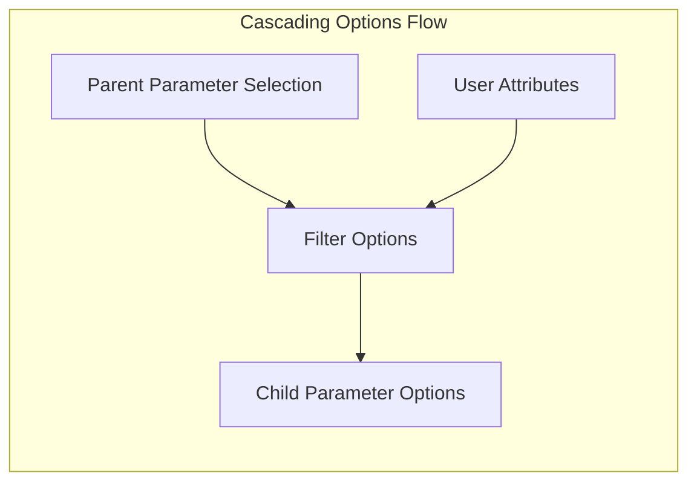

Cascading parameters is a powerful feature in Squirrels that allows you to dynamically filter parameter options based on the selection of a parent parameter or the attributes of the authenticated user. This creates more intuitive and focused user experiences by showing only relevant options.

<Note>

In this documentation, we refer to "select parameters" as single-select and multi-select parameters. Non-select parameters are DateParameter, NumberParameter, TextParameter, etc.

</Note>

## Overview

In Squirrels, a parameter's available options can be filtered (or "cascaded") based on two mechanisms:

1. **Parent parameter cascading**: A child parameter's options depend on what the user selects in a parent parameter
2. **User attribute cascading**: A parameter's options depend on attributes of the authenticated user

Both mechanisms work similarly: each parameter option specifies which parent values or user groups it belongs to, and at runtime, only matching options are shown to the user.



## Parent-child cascading

Parent-child cascading allows you to link parameters so that the available options in a child parameter change based on what is selected in the parent parameter.

### Basic example

Consider a scenario where you have a "Country" dropdown and a "City" dropdown. You only want to show cities that belong to the selected country:

```python pyconfigs/parameters.py highlight="6,21,28,32,36,42,46"
from squirrels import parameters as p, parameter_options as po


# Parent parameter
@p.SingleSelectParameter.create_simple(
    name="country",  # Name of the parent parameter
    label="Country",
    description="Select a country"
)
def country_options():
    return [
        po.SelectParameterOption(id="usa", label="United States", is_default=True),
        po.SelectParameterOption(id="canada", label="Canada"),
    ]


# Child parameter with cascading options
@p.SingleSelectParameter.create_with_options(
    name="city", label="City",
    description="Select a city",
    parent_name="country"  # Links this parameter to the parent
)
def city_options():
    return [
        # US cities - only shown when "usa" is selected
        po.SelectParameterOption(
            id="nyc", label="New York", 
            parent_option_ids="usa"
        ),
        po.SelectParameterOption(
            id="la", label="Los Angeles", 
            parent_option_ids="usa"
        ),
        po.SelectParameterOption(
            id="chicago", label="Chicago", 
            parent_option_ids="usa"
        ),
        
        # Canadian cities - only shown when "canada" is selected
        po.SelectParameterOption(
            id="toronto", label="Toronto", 
            parent_option_ids="canada"
        ),
        po.SelectParameterOption(
            id="vancouver", label="Vancouver", 
            parent_option_ids="canada"
        ),
    ]
```

When the user selects "United States", only New York, Los Angeles, and Chicago appear in the City dropdown. When "Canada" is selected, only Toronto and Vancouver appear.

### How it works

The cascading mechanism works through two key components:

1. **`parent_name`**: Specified in the factory method (`create_with_options` or `create_from_source`), this identifies which parameter is the parent
2. **`parent_option_ids`**: Specified in each parameter option, this lists which parent option IDs make this option visible

At runtime, Squirrels:
1. Gets the selected option(s) from the parent parameter
2. Filters child options to those where `parent_option_ids` intersects with the parent's selected IDs
3. Returns only the matching options to the user

### Multiple parent option IDs

A child option can be associated with multiple parent options. For example, a region that spans multiple countries:

```python highlight="4"
po.SelectParameterOption(
    id="great_lakes", 
    label="Great Lakes Region",
    parent_option_ids=["usa", "canada"]  # Shown for both countries
)
```

<Note>

For select parameters, each parent option ID can appear in zero or more child options. This means:
- A parent option might have no corresponding child options
- A parent option might have many corresponding child options
- A child option can belong to multiple parent options

</Note>

### Using data sources

When parameter options come from a database table, use `parent_id_col` in the data source to specify cascading:

```python pyconfigs/parameters.py highlight="7,17"
from squirrels import parameters as p, data_sources as ds


@p.SingleSelectParameter.create_from_source(
    name="city", label="City",
    description="Select a city",
    parent_name="country"
)
def city_source():
    return ds.SelectDataSource(
        table_or_query="""
            SELECT city_id, city_name, country_id
            FROM cities
        """,
        id_col="city_id",
        options_col="city_name",
        parent_id_col="country_id"  # Column containing parent option IDs
    )
```

## Cascading for non-select parameters

While select parameters cascade their list of options, non-select parameters (DateParameter, NumberParameter, etc.) cascade their configuration. This allows you to change defaults, constraints, and ranges based on parent selections.

### Example: Date parameter with cascading constraints

```python pyconfigs/parameters.py
from squirrels import parameters as p, parameter_options as po


# Parent parameter for fiscal year
@p.SingleSelectParameter.create_simple(
    name="fiscal_year", label="Fiscal Year",
    description="Select the fiscal year"
)
def fiscal_year_options():
    return [
        po.SelectParameterOption(id="fy2023", label="FY 2023"),
        po.SelectParameterOption(id="fy2024", label="FY 2024", is_default=True),
    ]


# Child date parameter with constraints that vary by fiscal year
@p.DateParameter.create_with_options(
    name="report_date", label="Report Date",
    description="Date within the selected fiscal year",
    parent_name="fiscal_year"
)
def report_date_options():
    return [
        po.DateParameterOption(
            default_date="2023-01-01",
            min_date="2023-01-01",
            max_date="2023-12-31",
            parent_option_ids=["fy2023"]
        ),
        po.DateParameterOption(
            default_date="2024-01-01",
            min_date="2024-01-01",
            max_date="2024-12-31",
            parent_option_ids=["fy2024"]
        ),
    ]
```

When "FY 2023" is selected, the date picker is constrained to 2023 dates. When "FY 2024" is selected, the constraints switch to 2024.

<Warning>

For non-select child parameters, each parent option ID can appear in **at most one** child option. This is because non-select parameters use a single configuration rather than a list of selectable options.

</Warning>

## Rules for parent parameters

Not all parameter types can be parents. The rules are:

| Child parameter type | Allowed parent types |
|---------------------|---------------------|
| Select parameters | [SingleSelectParameter] or [MultiSelectParameter] |
| Non-select parameters | [SingleSelectParameter] only |

<Tip>

**Why the restriction?** Non-select child parameters need exactly one configuration at any time. If the parent were a multi-select with multiple selections, it would be ambiguous which child configuration to use. Single-select parents always have exactly one selection.

</Tip>

## User attribute cascading

User attribute cascading filters parameter options based on an attribute of the authenticated user. This is useful for role-based access control or personalization.

### Basic example

```python pyconfigs/parameters.py highlight="7,13,17,21"
from squirrels import parameters as p, parameter_options as po


@p.SingleSelectParameter.create_with_options(
    name="report_type", label="Report Type",
    description="Select the type of report",
    user_attribute="access_level"  # Built-in user attribute
)
def report_type_options():
    return [
        po.SelectParameterOption(
            id="summary", label="Summary Report",
            user_groups=["admin", "member", "guest"]  # Available to all
        ),
        po.SelectParameterOption(
            id="detailed", label="Detailed Report",
            user_groups=["admin", "member"]  # Restricted authenticated users
        ),
        po.SelectParameterOption(
            id="executive", label="Executive Dashboard",
            user_groups=["admin"]  # Admin only
        ),
    ]
```

When a user with `access_level="guest"` makes a request, they only see the "Summary Report" option. A member user would see "Summary Report" and "Detailed Report", while an admin user would see all three options.

### How it works

The user attribute cascading mechanism works through two components:

1. **`user_attribute`**: Specified in the factory method, this identifies which user attribute to check
2. **`user_groups`**: Specified in each parameter option, this lists which attribute values make this option visible

At runtime, Squirrels:
1. Gets the value of the specified attribute from the authenticated user
2. Filters options to those where `user_groups` contains the user's attribute value
3. Returns only the matching options to the user

### Using custom user fields

If you define custom fields in `pyconfigs/user.py`, you can use them for cascading by prefixing with `custom_fields.`:

```python pyconfigs/parameters.py
@p.MultiSelectParameter.create_with_options(
    name="department", label="Department",
    description="Select departments to view",
    user_attribute="custom_fields.role"  # Custom field defined in user.py
)
def department_options():
    return [
        po.SelectParameterOption(
            id="sales", label="Sales",
            user_groups=["manager", "analyst"]
        ),
        po.SelectParameterOption(
            id="finance", label="Finance",
            user_groups=["manager", "finance_team"]
        ),
    ]
```

### Same rules apply

The same rules that apply to parent-child parameter cascading also apply to user attribute cascading:

- For select parameters: Each user group value can appear in zero or more options
- For non-select parameters: Each user group value can appear in **at most one** option

### Using data sources

When parameter options come from a database, use `user_group_col`:

```python pyconfigs/parameters.py highlight="3,13"
@p.SingleSelectParameter.create_from_source(
    name="department", label="Department",
    user_attribute="role"
)
def department_source():
    return ds.SelectDataSource(
        table_or_query="""
            SELECT dept_id, dept_name, allowed_role
            FROM departments
        """,
        id_col="dept_id",
        options_col="dept_name",
        user_group_col="allowed_role"  # Column containing user group values
    )
```

## Combining parent and user attribute cascading

You can use both parent cascading and user attribute cascading on the same parameter:

```python pyconfigs/parameters.py
@p.SingleSelectParameter.create_with_options(
    name="project", label="Project",
    description="Select a project",
    parent_name="department",      # Cascades from department selection
    user_attribute="access_level"  # Also filters by user's access level
)
def project_options():
    return [
        po.SelectParameterOption(
            id="proj_a", label="Project A",
            parent_option_ids=["engineering"],
            user_groups=["admin", "member"]  # Available to admin and member
        ),
        po.SelectParameterOption(
            id="proj_b", label="Project B (Confidential)",
            parent_option_ids=["engineering"],
            user_groups=["admin"]  # Only admins can see this
        ),
    ]
```

An option is only shown if **both** the parent parameter has one of the parent option IDs selected AND the user attribute value is in the user groups for that option.

<Note>

When combining both cascading types for non-select parameters, each unique combination of (parent_option_id, user_group) can appear in at most one child option.

</Note>

## Disabled parameters

A parameter becomes **disabled** when it has no available options after filtering. This can happen when:

- The parent parameter's selection doesn't match any `parent_option_ids` in the child's options
- The user's attribute value doesn't match any `user_groups` in the parameter's options

### Checking for disabled parameters

In `context.py` or data models, use `sqrl.param_exists()` to check if a parameter is enabled:

```python pyconfigs/context.py
def main(ctx: dict, sqrl: args.ContextArgs) -> None:
    if sqrl.param_exists("city"):
        city_param = sqrl.prms["city"]
        ctx["selected_city"] = city_param.get_selected_id()
```

## Summary

| Feature | For select parameters | For non-select parameters |
|---------|----------------------|--------------------------|
| Parent must be | SingleSelectParameter or MultiSelectParameter | SingleSelectParameter only |
| Options per parent ID | Zero or more | At most one |
| Options per user group | Zero or more | At most one |
| Cascades | List of selectable options | Configuration (defaults, constraints) |

## Related pages

- [Widget parameters] - Configure parameters in Python
- [Parameter] - See all available parameter types here
- [SingleSelectParameter] - Single-select parameter reference
- [MultiSelectParameter] - Multi-select parameter reference
- [DateParameter] - Date parameter reference
- [SelectParameterOption] - Options for select parameters
- [DateParameterOption] - Options for date parameters

[Widget parameters]: /project/pyconfigs/parameters
[Parameter]: /references/python/types/parameter
[SelectParameterOption]: /references/python/parameter_options/selectparameteroption
[DateParameterOption]: /references/python/parameter_options/dateparameteroption
[SingleSelectParameter]: /references/python/parameters/singleselectparameter
[MultiSelectParameter]: /references/python/parameters/multiselectparameter
[DateParameter]: /references/python/parameters/dateparameter
