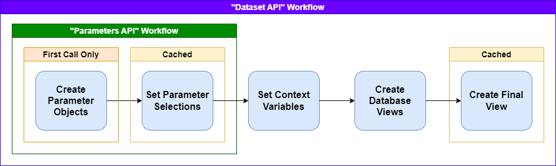

# Overview

Understanding the why's and how's of the squirrels framework

---

## Purpose

Imagine you're a BI or data analyst for a bank, and you have a record of data for every time the bank provided a loan. Every loan record would have columns for the date, the loan amount, the interest rate, the credit score, the location, and dozens of other attributes. The business teams may have questions like the total loan amount per week for the last 12 weeks or the average interest rate offered by credit score tier. You build a sql query to answer one of these questions, and since the number of records grow over time, you save the sql query such that the same question can be answered again and again for subsequent weeks.

This is great at all, but unfortunately, the amount of hours in effort is directly proportional to the number of business questions that need to be answered. It would be better if the sql query can take parameters to be dynamically generated with various values for columns to group by, metrics to show, filters to apply, etc. And this framework allows you to do just that! Parameter types include (but not limited to) single-select, multi-select, dates, and numeric values.

Certain BI applications, such as Tableau, provide ways to specify parameters and create dynamic data analytics based on selected parameter values. However, the logic behind how the parameters affect the analytical queries is isolated in Tableau. Ideally, the logic should be reusable by multiple applications, even by applications you can create yourself! This can be done if there is a REST API that performs the calculations by using the query parameters for parameter values and using the response body for the tabular results. Thankfully, the squirrels framework makes it easy to create these APIs without having to be an expert in developing REST APIs from scratch!

Keep in mind that the use case extends beyond just loan events or financial data. Any sort of data analytics can make use of this framework! For examples, it can used to create APIs for analyzing weather metrics by time period/location, analyzing demographics of segments of population, or analyzing revenue/expenses for various segments of a business.

## Basic Concepts

Similar to how web frameworks render templated HTML by retrieving records from a database with (mostly) static queries, the squirrels framework render templated (complex) SQL queries from query parameters to create tabular results that can be sent back as JSON (or any format that can represent structured data). The templating language for the SQL queries is [Jinja](https://jinja.palletsprojects.com/). All sql queries that can be represented by the same templated SQL query is known as a "dataset".

First, an application can get the name and resource paths of all the datasets of a squirrels project by using a GET request on the base resource path for the project:

```
/project/basepath
```

Suppose we have a dataset that can be retrieved from the following API resource path using a GET request:

```
/project/basepath/dataset
```

This dataset may have parameters that can be provided through query parameters. The application can retrieve all the parameter details for the dataset by adding a `/parameters` suffix to the dataset's resource path with a GET request as such:

```
/project/basepath/parameters
```

Certain parameters may cascade. For instance, if there are parameter for `country` and `city` filters, the options for `city` can be limited by the selected value for `country`. Thus, the parameters' path can use the same query parameters as the dataset's path to deal with the cascading effects. For both paths, the default value(s) for the parameter is used if the parameter value is not specified.

Parameter details (such as parameter options) can either be purely specified in the squirrels project's dataset folder (in the [parameters.py] file), or retrieved from lookup tables in the database. For the first time that a datatset API is triggered on a server, parameters get converted into objects in memory, which may include queries to the database. This applies to both the parameters' and dataset paths. After the first call to one, subsequent calls to either paths would have these objects cached in memory and don't require further database queries to retrieve parameter details.

Next, a copy of the cached parameter objects are created, and the parameter values (taken from the query parameters) are set on these parameter objects. A copy must be made such that concurrent API requests don't end up overriding parameters selections on each other. The parameter object collections are cached based on the query parameters provided such that two parameters API requests with the same query parameters don't have to re-apply the copying and cascading effects.

Once the parameter selections are finalized, "context variables" are constructed. These are python variables that can be created at runtime after parameter selections are set in the [context.py] file. For example, a context variable can be a comma-delimited string value of the selected options of a multi-select parameter. The [context.py] is actually optional, and no context variables are set when this file doesn't exist.

Then, one or more templated sql queries are rendered to run against one or more database(s)/data warehouse(s). These templated can access python variables for parameter objects, context variables, or "project variables". Project variables are fixed values set for the squirrels project such as "version". The rendered sql queries and results are known as "database views". Alternatively, instead of templated sql, database views can also be a python function that returns a pandas dataframe. See the [database views] docs for more information.

Finally, there is a "final view" that runs in the API server's memory to combine all the database views together to create the final result for the dataset. The final view can be a templated sql query as well. The API server is generally easier to horizontally scale compared to databases. This works by loading all the results of the database views as tables in an in-memory sqlite database and using the final view query to process the tables. The final view can also be a python function that takes all the database views as inputs (as pandas dataframes), and returns one pandas dataframe as a result. Or in the simplest case, the final view can just be the name of one of the database views. The final results are cached based on the query parameters provided such that two parameters API requests don't have to do the same work. See the [final view] docs for more information.

The diagram below visualizes this workflow:



[parameters.py]: user-guide/parameters.md
[context.py]:user-guide/context.md
[database views]: user-guide/database-views.md
[final view]: user-guide/final-view.md